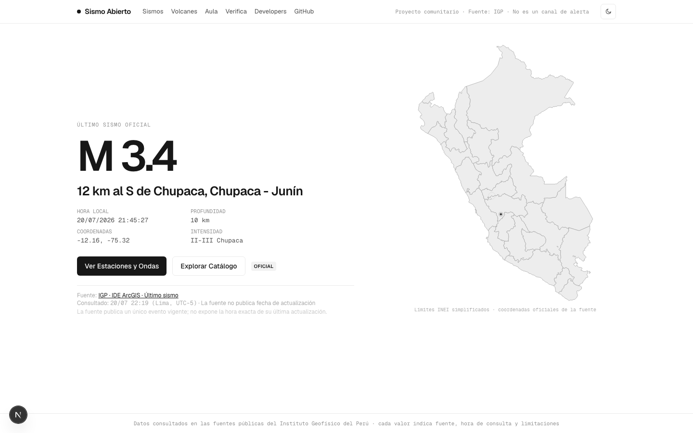

<div align="center">
  

  <h1>Sismo Abierto</h1>

  <p><strong>Sismos oficiales de Perú y Colombia, abiertos y trazables.</strong></p>

  <p>
    Ecosistema open source sobre los datos sísmicos, acelerométricos y volcánicos
    públicos del Instituto Geofísico del Perú y el Servicio Geológico Colombiano.
  </p>

  <p>
    <a href="https://github.com/crafter-research/sismo-abierto/actions/workflows/ci.yml"></a>
    <a href="https://github.com/crafter-research/sismo-abierto/actions/workflows/source-drift.yml"></a>
    <a href="LICENSE"></a>
  </p>

  <picture>
    <source media="(prefers-color-scheme: dark)" srcset="assets/screenshot-dark.png" />
    
  </picture>
</div>

> [!IMPORTANT]
> Proyecto comunitario, **no oficial**. Fuentes de datos: IGP y, de forma
> experimental, SGC. No es un sistema de
> alerta ni de predicción, y no reemplaza los canales oficiales.

## Qué incluye

Nueve productos sobre un mismo núcleo de datos normalizado y trazable:

| Producto | Ruta | Qué hace |
|----------|------|----------|
| **Sismos Perú** | `/peru`, `/peru/sismos` | Último sismo del IGP, catálogo CENSIS, estaciones y ondas Z/N/E |
| **Sismos Colombia** | `/colombia`, `/colombia/sismos` | Último sismo y catálogo del SGC con estado automático o manual |
| **Emergencias** | `/colombia/emergencia` | Parámetros sísmicos automáticos, cortes humanitarios revisados e historial versionado |
| **API** | `/api` | Contrato OpenAPI 3.1 con referencia interactiva (Scalar) |
| **CLI** | `sismo` | Los mismos datos desde terminal, con exports JSON/GeoJSON/CSV |
| **Aula** | `/aula/*` | Lecciones y laboratorios construidos sobre eventos reales |
| **Verifica** | `/verifica/*` | Afirmaciones virales congeladas y auditadas contra catálogos oficiales y azar |
| **Volcanes** | `/volcanes/*` | Los 16 registros volcánicos publicados, con frescura explícita |
| **Fuentes** | `/fuentes/*` | Confiabilidad observada de cada fuente pública, desde el consumidor |

## Principios de confianza

- Cada valor se clasifica: `OFICIAL`, `DERIVADO`, `EXPLICACIÓN` o `NO DISPONIBLE`.
- Cada respuesta incluye fuente, URL oficial, hora de consulta con zona horaria y limitaciones.
- Si una fuente no publica fecha de actualización, se muestra `FRESHNESS_UNKNOWN` — nunca se
  infiere vigencia.
- Un fallo de fuente es un estado visible, nunca datos vacíos que parecen válidos.
- Los datasets se consultan en origen y no se redistribuyen; la caché es solo técnica.
- Las afirmaciones de Verifica se congelan **antes** de conocer el resultado, con protocolo
  y tasa base publicados.

## Quickstart

Requiere [Bun](https://bun.sh).

```bash
git clone https://github.com/crafter-research/sismo-abierto
cd sismo-abierto
bun install
bun run dev        # web en http://localhost:3000
```

Abre `/peru` o `/colombia`. El switcher global conserva URLs canónicas por país y los
datos visibles se actualizan automáticamente cada 60 segundos.

```bash
bun run check      # biome + typecheck
bun run test       # tests de unidades y contrato
bun run test:e2e   # journeys de Playwright
bun run build      # build de producción
bun run drift      # linter de contratos contra las fuentes en vivo
```

### CLI

```bash
bunx --bun @crafter/sismo-cli latest
bunx --bun @crafter/sismo-cli events --since 7d --min-magnitude 4 --format geojson
SISMO_SGC_PROVIDER=true bunx --bun @crafter/sismo-cli latest --provider sgc
SISMO_SGC_PROVIDER=true bunx --bun @crafter/sismo-cli events --provider sgc --since ytd --min-magnitude 3 --format geojson
bunx --bun @crafter/sismo-cli incident colombia-2026-08-10 --json
bunx --bun @crafter/sismo-cli schema events
```

Desarrollo local:

```bash
bun apps/cli/src/main.ts latest
bun apps/cli/src/main.ts events --since 7d --min-magnitude 4 --format geojson
bun apps/cli/src/main.ts stations ran-20260468 --sort pga
bun apps/cli/src/main.ts waveform ran-20260468 SCHYO --format csv --output onda.csv
bun apps/cli/src/main.ts sources --probe
bun apps/cli/src/main.ts incident colombia-2026-08-10
bun apps/cli/src/main.ts schema events
```

Salida humana en tablas; `--json`, `--geojson`, `--csv` y `schema` sin decoración. Errores a stderr
con códigos de salida estables (`0` ok · `2` input inválido · `3` no encontrado · `4` fuente
caída o contrato roto). `--open` abre la fuente oficial del dato en el navegador.

### Coding agents

```bash
bunx --bun skills add crafter-research/sismo-abierto
```

Instala la skill [`sismo-cli`](skills/sismo-cli/SKILL.md) para que tu agente (Claude Code,
Cursor, Codex…) sepa operar cada vertical con salida JSON, exit codes estables y procedencia
en cada respuesta. En runtime, `sismo skill` imprime la misma documentación.

## Linter de contratos externos

Las superficies consumidas del IGP y el SGC no publican SLA ni changelog. El paquete `@sismo/source-health` valida
cada respuesta campo por campo contra el contrato observado (esquemas zod por fuente) y
distingue:

- `ROTO` — un campo requerido desapareció o cambió de tipo → estado `SCHEMA_CHANGED`.
- `NUEVO` — la fuente agregó campos → no rompe, pero queda reportado en la evidencia.

El workflow [`source-drift.yml`](.github/workflows/source-drift.yml) lo corre cada 6 horas
contra las fuentes reales; si un contrato se rompe, el workflow falla y lo ves antes que tus
usuarios.

Cada fuente expone un badge SVG cacheable en
`/api/v1/sources/{sourceId}/badge.svg`, por ejemplo:


## Arquitectura

```text
apps/web                 Next.js (App Router, Server Components, Tailwind)
apps/cli                 paquete canónico `@crafter/sismo-cli`
apps/cli-alias           alias no scoped publicado como `sismo`
packages/contracts       modelo normalizado, esquemas zod y documento OpenAPI
packages/data            adaptadores server-side con timeouts, retries y caché
packages/incidents       registro de incidentes, snapshots versionados y store Neon
packages/waveforms       parser ACELDAT, métricas sobre serie completa, reducción visual
packages/audit           afirmaciones congeladas, geografía, ventanas, tasa base, veredictos
packages/volcanoes       contenido educativo de niveles volcánicos
packages/source-health   probes, linter de contratos, estados deterministas, stores
content/aula             lecciones versionadas
data/predictions         afirmaciones congeladas (inmutables; cambios auditados en git)
```

Fuentes consumidas: IDE ArcGIS/GeoServer del IGP, catálogo CENSIS, ACELDAT-PERÚ, REGEN,
feeds y API sísmica del SGC, y USGS FDSN como contraste global. El comportamiento observado de cada una está documentado
en [`docs/implementation-status.md`](docs/implementation-status.md).

### Colombia · SGC experimental

La integración con el **Servicio Geológico Colombiano** conserva el identificador oficial,
el estado `automatic` o `manual`, la hora de Bogotá y la procedencia de cada evento. Usa el
feed estático para el último evento, la API quincenal en ventanas de hasta 14 días para el
catálogo y el snapshot oficial para el detalle. No incluye estaciones ni formas de onda.

En producción permanece desactivada salvo que `SISMO_SGC_PROVIDER=true`. Los términos
generales del SGC no conceden de forma inequívoca permiso para transformar y republicar este
feed, por lo que el flag solo debe activarse después de obtener autorización escrita. La
decisión técnica, el mapeo de campos y el riesgo legal están en
[`docs/sgc-provider.md`](docs/sgc-provider.md).

### Emergencias en tiempo casi real

La ruta `/colombia/emergencia` separa dos flujos:

- El evento sísmico del SGC se consulta como máximo una vez por minuto, se guarda como una
  versión automática y la página se refresca cada 60 segundos.
- Fallecidos, heridos, daños y recursos entran como candidatos privados. Solo una aprobación
  explícita los convierte en el corte humanitario público.

Trigger.dev sincroniza cada minuto. Un cron de Vercel cada cinco minutos sirve como respaldo y
la lectura pública puede autocorregirse si ambos se retrasan. Las consultas al SGC usan caché
compartida de 60 segundos y coalescing en proceso para evitar ráfagas duplicadas.

La página enlaza a [Reporte CO](https://co.crafter.run) como mapa ciudadano independiente,
sin ingerir sus reportes ni mezclarlos con los cortes oficiales de SGC y UNGRD.

Variables de producción:

```text
DATABASE_URL
SISMO_SGC_PROVIDER=true
INCIDENT_ADMIN_SECRET
CRON_SECRET
TRIGGER_PROJECT_REF
```

El contrato público está en `GET /api/v1/incidents/{slug}` y en
`sismo incident INCIDENT_SLUG --json`. El procedimiento de revisión, los payloads privados y
la migración están documentados en [`docs/incidents.md`](docs/incidents.md).

## De dónde salen las fuentes

Antes de consumir un servicio se le hace recon y se escribe un reporte con lo
observado. La capa de terreno existe porque uno de esos reportes encontró un
GeoServer WFS abierto del IGP que no estaba documentado en ninguna parte.

El índice, con el veredicto de cada uno, está en [`recon/README.md`](recon/README.md).

## Roadmap

Ver [ROADMAP.md](ROADMAP.md).

## Contribuir

¿Eres especialista y algo está mal interpretado? Abre un issue con la etiqueta
`corrección-científica` — la exactitud y la atribución al IGP y al SGC van primero. Las nuevas
afirmaciones para Verifica entran por PR con evidencia temporal previa al resultado.

## Licencia

[MIT](LICENSE) © Crafter Research. Los datos pertenecen a sus fuentes oficiales y se
consultan en origen.
